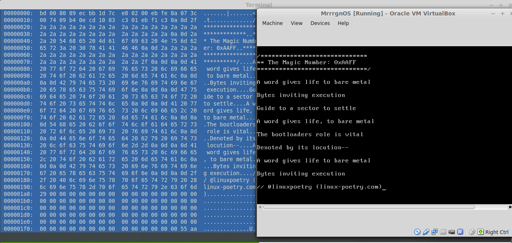

Linux Poem No.16
======================

Read the latest Linux poem on bare metal! That's right, no OS required. :)

The poem is a [Triolet](https://en.wikipedia.org/wiki/Triolet) about the `magic number` 0xAA55: the byte signature used to denote a bootable sector on x86 systems. The signature prompts BIOS to execute the preceding bytes in the sector as a program. This is the way that bootloaders, like GRUB, are launched.

The bootloader in this repository is just a modified "hello world" -- it prints the text of the poem. An iso is included so you can boot a bare metal system from it if you're brave! I'd recommend just using qemu or virtualbox otherwise.

</img>

Notes:

- If you'd like to create your own bootloader check out: [Writing a Simple Operating System from Scratch](http://www.cs.bham.ac.uk/~exr/lectures/opsys/10_11/lectures/os-dev.pdf) by Nick Blundell

Usage:

  Simply use the included iso image as you would a live disk or install qemu and run ``make qemu`` to run on an emulated cpu

Development:
  
  Edit linux-poem-16-bootloader and run ``make``  then ``make iso`` to regenerate linux-poem-16.iso
