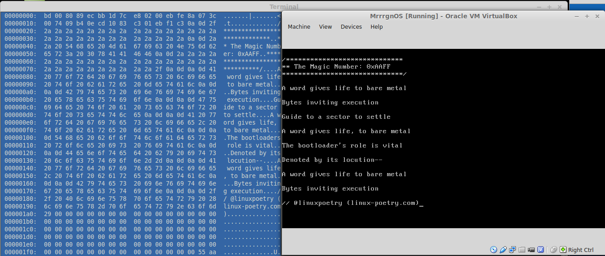

linux-poem-16
======================

Read the latest Linux poem on bare metal! That's right, no OS required. :)

The poem is a [Triolet](https://en.wikipedia.org/wiki/Triolet) about the magic number, which is the byte signature used to denote a bootable sector. The signature lets BIOS know it can run this 512 (usuall) byte chunk as executable code.

The bootloader in this repository is stupid simple. It literally just prints the text of the poem, however, an iso is included so you can boot a bare metal system into the poem (well, at least a program that prints it out)!

</img>

Notes:

- Bootloader written with hexer

- Boot image created via mkisofs [El-Torito](http://wiki.osdev.org/El-Torito)

- If you'd like to create your own bootloader check out: [Writing a Simple Operating System from Scratch](http://www.cs.bham.ac.uk/~exr/lectures/opsys/10_11/lectures/os-dev.pdf) by Nick Blundell

Usage:

  Simply use the included iso image as you would a live disk or install qemu and run ``make qemu`` to run on an emulated cpu

Development:
  
  Edit linux-poem-16-bootloader and run ``make``  then ``make iso`` to regenerate linux-poem-16.iso
